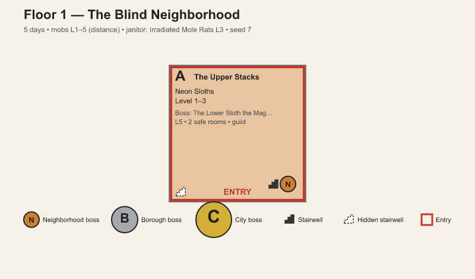
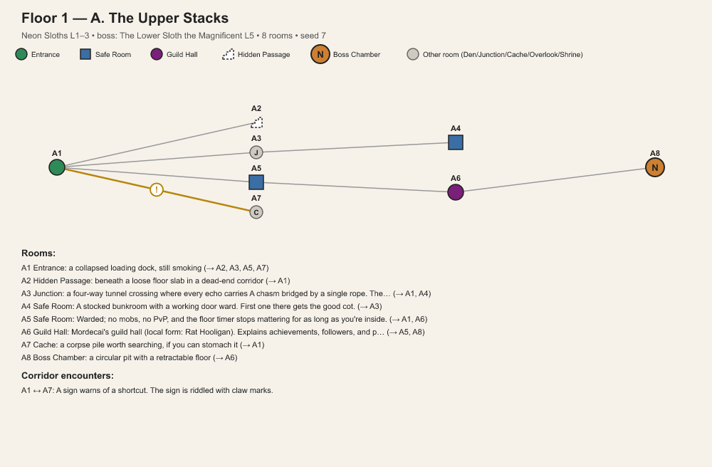

# DCC Mapgen

A procedural floor/map generator in the style of the *Dungeon Crawler Carl* book series (Matt Dinniman). Generates Markdown write-ups and SVG/PNG maps for Floors 1–6 and 8–11, with random (but seed-reproducible) neighborhoods, bosses, mobs, loot, quests, and — for Floors 1 and 2 — a full room-by-room layout for every neighborhood.

> **Unofficial fan project.** This tool is not affiliated with, endorsed by, or reviewed by Matt Dinniman, his publishers, or any other rights holders. It's a GM/worldbuilding aid built from publicly available fan-wiki lore, meant for personal tabletop/solo use.

## Features

- **Floors 1 & 2** — neighborhood/borough/city grid, bosses (with a word-bank uniqueness guard so names/forms don't collide), loot boxes, achievements, an Elite, other crawler teams, the tutorial guild, and a full connected **room graph** per neighborhood (safe rooms, hidden passages, guild hall, filler rooms, corridor encounters).
- **Floor 3** (The Over City) — settlements on a wilderness grid, roaming bosses, locked stairwells, quests, one Elite.
- **Floor 4** (The Iron Tangle) — schematic rail/transit map.
- **Floor 5** (The Bubbles) — four quadrants, castles, factions.
- **Floor 6** (The Hunting Grounds) — Floor 3's grid reskinned as jungle, with hunter parties and a bounty board.
- **Floor 8** (Ghosts of Earth) — polar folklore map with totem cards and a deckmaster ladder.
- **Floor 9** (Faction Wars) — the nine-slice pie around Larracos, warlords, stance paths.
- **Floor 10** (Don't Come In Last) — seven-heat race season, garage/vehicle/upgrades.
- **Floor 11** (A Parade of Horribles) — parade route, judges, arena boss.
- Every floor supports `--seed` for reproducible maps, and `--image`/`--save` for SVG or PNG output (PNG needs the optional `resvg-py` package).
- `--rooms-for` can (re)generate just the room-level detail for one neighborhood from a floor you already generated and are playing, without touching the rest of the data.

Word banks (names, mobs, bosses, loot, room flavor, etc.) live in `data/*.json` — edit those to add or reskin content without touching the code.

## Examples

| Main map | Room detail (per neighborhood) |
|---|---|
|  |  |

(`floor1_medium_seed477717.md` in this repo is a full sample write-up if you want to see the Markdown output.)

## Installation

### Option A: run from source (any OS)

Requires Python 3.9+.

```
git clone https://github.com/MumblesCrzy/DCC_Mapgen.git
cd DCC_Mapgen
pip install -r requirements.txt   # optional, only needed for PNG output
python dcc_mapgen.py --floor 1 --size medium
```

### Option B: standalone executable (Windows)

Check the [Releases](../../releases) page for a bundled `.exe` — no Python install required. Built automatically from this repo via GitHub Actions.

## Usage

```
python dcc_mapgen.py --floor 1 --size medium
python dcc_mapgen.py --floor 2 --size large --scaling distance --seed 42
python dcc_mapgen.py --floor 1 --size small --days 5 --out floor1.md
python dcc_mapgen.py --floor 2 --size large --seed 9 --out f2.md --image f2.svg
python dcc_mapgen.py --floor 2 --size large --save maps/     # writes maps/floor2_large_seedNNN.md + .png + room maps

# Add room-level detail to a neighborhood you already generated and are playing:
python dcc_mapgen.py --rooms-for my_floor1.md --rooms-for-label C --seed 42 --image roomC.png
```

Run `python dcc_mapgen.py --help` for the full flag list (per-floor options like `--region`, `--warlords`, `--vehicle`, `--party`, etc.).

## License

GPL-3.0 — see [LICENSE](LICENSE). The code is free to use, modify, and redistribute under those terms; the *Dungeon Crawler Carl* setting, names, and lore referenced by the word banks belong to their respective rights holders.
